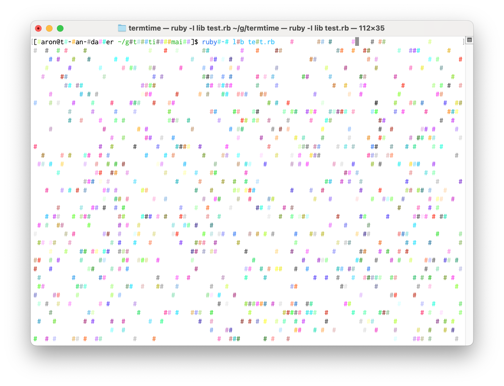

# TermTime

TermTime is a pure Ruby terminfo library. You can use it to get information
about your terminal, and print cool stuff!

Here is an example that prints random colored characters to your display:

```ruby
require "termtime"
require "io/console"

tty = IO.console
y, x = tty.winsize

trap("WINCH") { y, x = tty.winsize }

ti = TermTime::TermInfo.new

begin
  loop do
    print ti.str("cup").tparm(rand(y), rand(x))
    print ti.str("setaf").tparm(rand(255))
    print "#"
    sleep 0.01
  end
ensure
  print ti.str("sgr0").value
  puts
end
```

Running the above program will make your terminal look something like this:


